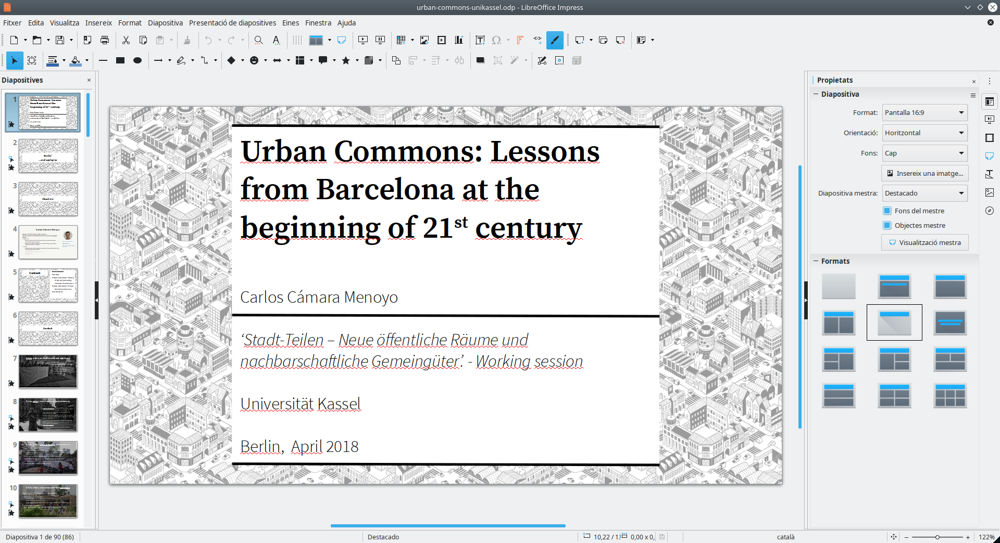

+++
title = "Looking for the 'perfect' presentations' solution (for me)"
date = 2019-03-08T15:10:07+01:00
draft = true

# Tags and categories
# For example, use `tags = []` for no tags, or the form `tags = ["A Tag", "Another Tag"]` for one or more tags.
tags = ["reveal.js", "reports", "markdown"]
categories = ["Data Science"]
people = [""]
projects = [""]

# Featured image
# Place your image in the `static/img/` folder and reference its filename below, e.g. `image = "example.jpg"`.
# Use `caption` to display an image caption.
#   Markdown linking is allowed, e.g. `caption = "[Image credit](http://example.org)"`.
# Set `preview` to `false` to disable the thumbnail in listings.
[header]
[image]
placement = 3
# Caption (optional)
caption = "Presenting at 'Collaborative Cartographies' (October 19th, 2019)"

# Focal point (optional)
# Options: Smart, Center, TopLeft, Top, TopRight, Left, Right, BottomLeft, Bottom, BottomRight
focal_point = "Smart"

+++

During last 10 years [I have given a number of talks](/talks) in various contexts due to my job as a lecturer: either lectures for my students, conferences, workshops or even much more informal events, usually speaking about cities, commons, maps or accessibility. I enjoy it because I love sharing knowledge with others but also because it is when I am preparing presentations (by summarising and highlighting the main topics or thinking of the storytelling) where I reflect and learn the most. It is for that reason that I am always looking for the right software that allows me to create appealing slides in a relatively fast way. In this post I will be sharing some of the decisions I have made and the results I got regarding that matter.

In order to prepare my presentations I have used and tested several presentation softwares and services, such as the classic **Powerpoint**, **LibreOffice Impress** ([View example](https://speakerdeck.com/ccamara/comunes-urbanos-lecciones-desde-la-barcelona-de-principios-del-siglo-xxi)), **Google Slides** or, **Prezi** ([Example](https://prezi.com/m9hb9o591b-j/introduction-to-digital-fabrication/), [Example](https://prezi.com/-t-vbxr_jzz5/mapas-y-drupal-o-como-no-perderse-en-el-intento/)). All of them are really good pieces of sofware and you can create great presentations with them. However, as time goes by, I have become more concerned with technopolitics and data autonomy on the one hand, and with efficiency on the other. As a result, I have come to outline the following list of requirement that my software of choice should have:

1. It must allow me to **own my (own) data** and to easily reuse and share it with others for any purpose.
2. It should be **opensource**.
2. It must allow **offline editing and displaying**.
3. It must allow **adding content without having to worry about formatting it**. Ideally I should be able to write in plain text or markdown (or the like) which will later be formatted and converted into a final good-loking format. I want to focus on adding content very fast for scaffolding it: I want to edit it in plain text or markdown.
4. It should **look good** (uh!)

So, with those requirements in mind, I started to look for candidates that would fit in those selection criteria. After a while, I ended up with the following shortlist[^finalists]\:

* **[LibreOffice Impress](https://www.libreoffice.org/discover/impress/)**: a conventional desktop software for presentations. It is opensource and multiplatform and it is part of LibreOffice suite.
* **[Impress.js](https://impress.js.org/)**: a presentation framework based on the power of CSS3 transforms and transitions in modern browsers and inspired by the idea behind prezi.com. It allows moving through an infinite canvas, like the former, but also in 3D!
* **[Reveal.js](https://revealjs.com/#/)**: an HTML presentation framework. Halfway between the two others, as it creates slides' decks that can be opened with any web browser with a two-axis' navigation (unlike regular presentation software that only allows linear navigation).

Let's see how the competitors behave regarding each of my requirements:

| &nbsp;&nbsp;&nbsp;&nbsp;&nbsp;&nbsp;&nbsp;  | LO Impress | impress.js | reveal.js
|-----|-------------------------------------------------------------|------------------------------------------------------------ | ------------
| # 1 | Yes  | Yes | Yes |
| # 2 | Yes                                                                                | Yes | Yes |
| # 3 | Yes (ODP or PDF)                                                                   | Yes (Local html) | Yes (Local html file or PDF) |
| # 4 | No (although using styles makes things easier and are almost as valid workaround)  | Yes, using [hovercraft](http://regebro.github.io/hovercraft/) | Yes (multiple approaches) |
| # 5 | With effort | Somewhat | Yes! |

And now, let me further elaborate this summary table.

## LibreOffice Impress

Libreoffice is a regular desktop software that could be considered as Powerpoint's opensource replacement. It creates regular slides' deck and offers several templates with designs and layouts. Although I acknowledge that from LO foundation have put an effort in designing new templates and the stock defaults have improved dramatically, I cannot but help to consider that they still look somewhat oldies/traditional. However, I also admit that this is a completely subjective matter and can be fixed by either [dowloading one of the many available templates](https://extensions.libreoffice.org/templates/) or by creating our own.

After all, and to be completely honest, I have done so for many years. The good news is that LibreOffice's styles are a really powerful tool when used correctly. Styles allow to customize anything we want, starting from layouts but also paragraph styles, lists, images, tables... It may take some time to customize every style, but once you're done, it pays the effort: all your objects will look consistently and exactly the way you want without doing anyhing else. And if you ever change your mind... they will update automatically, preserving their consistency. Great, isn't it?!

Since it is a regular desktop software that means that it has to be installed in your computer if you want to edit your presentation. But if you do not have it installed, you can use any of the many softwares capable of reading ODP format, which is an open ISO standard or you can bring your own Portable edition. But if you only want to visualize the presentation, you can always export to PDF using the built-in feature (just one click), which is always an insurance that your presentation will always look the way you wanted it to be (custom fonts, I am looking at you!).

In order to add content you need to create text boxes, insert images, tables... add transitions, slides... using its GUI. This may seem a good thing, as it allows you to easily align objects and modify them on the fly. However, in my experience I found that approach to be very time consuming, as it often requires resizing objects, changing text-sizes, aligning, changing image properties...

Another inconvenient for me is that it is not easy to work with media other than images (like videos, websites, maps...), specially if they are not stored locally or require some interaction.

**Pros:**

* :white_check_mark: Ease of use
* :white_check_mark: Compatibility
* :white_check_mark: Customization
* :white_check_mark: Risk-free: export to PDF for your peace of mind
* :white_check_mark: Presenter's console

**Cons:**

* :x: Content editing is time consuming
* :x: No GIFs! or other interactive media
* :x: Outdated (default) appearance from the 90s
* :x: Only linear presentations

## Impress.js

<embed src="http://regebro.github.io/hovercraft/" width="100%" height="400px">
<figcaption>Clic on the text and use arrows to browse the presentation</figcaption>

I have to admit that I love Prezi and because unlike all the others, instead of working with independent slides that are displayed linearly, you can work with an infinite canvas that works at different scales at the same time. This allows completely different possibilities:  you can literaly go from the big picture to the smallest of the details. Or even the other way round: you can start with details that slowly conform a broader reality. Or, if you want, you can also use traditional slides.  Everything seemed perfect, except that it is not opensource and all your data is locked in a closed plattform and does not comply with any of my requirements.

Admitedly, I am so in love with it that I did my best looking for a good replacement. After discarding [Sozi](http://sozi.baierouge.fr/) I discovered [impress.js](https://impress.js.org/). Impress.js is a framework that benefits from Javascript and CSS3 properties and transitions that can virtually mimic Prezi in everything (plus the addition of being able to add 3D transitions and transformations).  Since it produces HTML files, they can be opened by any web browser and can include any type of media (even other embedded websites!). Also, it means that anything can be tweaked by using CSS. However, writing HTML is far from being fast, as it requires a lot of tags that need to be opened and closed.

The good news is that there is [hovercraft](http://regebro.github.com/hovercraft)! Hovercraft lets you write your content in [reStructuredText](https://en.wikipedia.org/wiki/ReStructuredText), which is very similar to markdown and, hence, very fast to write and read and it converts your text into a fully functional impress.js' website. It really has the good features of the two worlds, as it combines ease of editing with impressive results.

The only drawback is that it is not easy to create custom navigations (eg. following a path) nor to tweak the default (and basic) CSS styles.

**Pros:**

* :white_check_mark: Non-linear presentations
* :white_check_mark: Easy to add content by writing RST files
* :white_check_mark: Can be displayed in any web browser
* :white_check_mark: Presenter's console
* :white_check_mark: Accepts any type of media

**Cons:**

* :x: Basic CSS styles
* :x: Difficult to edit paths
* :x: You need to have hovercraft installed in your computer to create the output files
* :x: I have not succeeding in achieving the same results as with prezi (in terms of navigation, expresiveness and story-telling)

## Reveal.js

Quoting from their repo, Reveal.js is:

>A framework for easily creating beautiful presentations using HTML. Check out the live demo.
>
>reveal.js comes with a broad range of features including nested slides, Markdown contents, PDF export, speaker notes and a JavaScript API. There's also a fully featured visual editor and platform for sharing reveal.js presentations at slides.com.

**Pros:**

* :white_check_mark: Can be displayed in any web browser
* :white_check_mark: Looks great (nice default SCSS templates, which can be easily extended)
* :white_check_mark: Presenter's console
* :white_check_mark: Accepts any type of media
* :white_check_mark: Can create sections and sub-sections
* :white_check_mark: Easy to add content by writing in markdown plain text (there are many approaches to generate the HTML files from plain text -more in my next blog post)

**Cons:**

* :x: Not for everyone
* :x: Requires some time to set up
* :x: May not look the same in every device
* :x: PDF export requires Chrome/Chromium, and still doesn't look as nice as the original

[^finalists]: I am also aware of the existence of other solutions that my meet my requirements, but I haven't had the time to try them out, such as https://remarkjs.com/ or  https://www.emaze.com/
