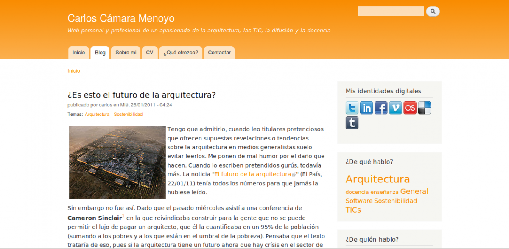

+++
title = "Web personal"
date = 2006-05-15T12:05:33+01:00
draft = false

# Tags: can be used for filtering projects.
# Example: `tags = ["machine-learning", "deep-learning"]`
tags = ["hugo","drupal", "wordpress", "web"]

# Project summary to display on homepage.
summary = "Desarrollo de esta web (y sus versiones anteriores)"

# Optional image to display on homepage.
image_preview = ""

# Optional external URL for project (replaces project detail page).
external_link = ""

# Does the project detail page use math formatting?
math = false

# Does the project detail page use source code highlighting?
highlight = true

# Featured image
# Place your image in the `static/img/` folder and reference its filename below, e.g. `image = "example.jpg"`.
[header]
caption = "Última versión en drupal"

+++

### +++CHANGELOG+++

2018/02/03: v.5.0-beta1
-------------------------

Abandono de CMS por un gestor estático ([Hugo](https://gohugo.io/)), para facilitar y agilizar el mantenimiento.

* Refactorización completa del sitio.
* Migración de buena parte de los contenidos.

2016/01/01: v.4.0-beta1
-------------------------

* Re-factorización completa de un sitio web en [Drupal](https://drupal.org)  7 aplicando features y perfiles de instalación.
* Migración de contenido
* Theme responsive creado desde cero (subtheme de Zen)

Esta versión puede verse en https://v4.carloscamara.es

2011/03/08: v3.0
-------------------------

Migración de los dos wordpress (blog y web curricular) a una sola instalación de drupal.
Cambio de arquitectura, diseño y funcionalidades de la web.

* Gestor: [Drupal](https://drupal.org) 7 (una sola instalación para blog, web curricular y lo que se preste )
* Diseño: plantilla provisional modificada a partir de la plantilla Bartik

Esta versión puede verse en https://v3.carloscamara.es

2008/12/??: v2.1
-------------------------

Cambio ligero en el diseño y creación de otro blog instalado en la raiz del dominio para gestionar únicamente aspectos curriculares, utilizando exactamente la misma apariencia gráfica que el blog existente.
Este sistema surgía de la dificultad de mantener actualizado mi CV con la página HTML ya que permitía tener uno fácilmente actualizable, tal y como ya hacía con el blog.

* Gestor: dos instalaciones independientes de Wordpress 2.7, una para el blog y otra para la web curricular
* Diseño: Plantilla modificada ligeramente para
  - aprovechar nuevos widgets
  - ampliación del ancho de sidebar derecho
  - se añade botones de compartir en la red

2007/12/??: v2.0
-------------------------

migración de carloscamara.es al gestor de contenidos Wordpess en una subcarpeta "/blog".
Utilización de wordpress para gestionar el blog, enlaces a otras webs, categorizar entradas... se mantiene el sitio HTML en la raiz del sitio para la web curricular.

* Gestor: Wordpress 2.0 "Duke" (blog)
* HTML para web curricular (sigue sin alteraciones)
* Misma plantilla CSS (sigue sin alteraciones)

2006/12/03: v1.0
-------------------------

Creación de un sitio web en HTML que combina la integración de un blog realizado en Blogger con la misma plantilla gráfica.
Este método permitía tener un sitio dinámico que permitiese comentarios y actualizaciones constantes conuna misma apariencia gráfica y sin tener conocimientos de programación.

* Gestor: Blogger (blog)
* HTML para web curricular
* Misma plantilla CSS

2006/05/??: v0.1
-------------------------

Tras la experiencia de haber desarrollado +arquitectura y gracias al empujón de una iniciativa del Ministerio de Industria para que los españoles podamos tener un dominio .es a 1€, nace carloscamara.es como excusa para profundizar en el aprendizaje de HMTL y CSS y para tener un blog propio.
