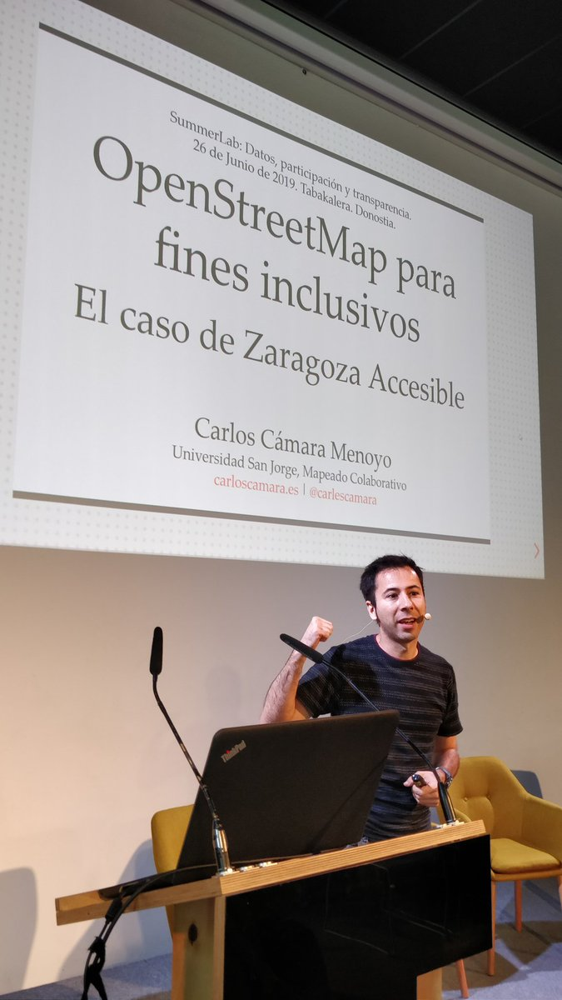

+++
title = "Usando OpenStreetMap con fines inclusivos: el caso de Zaragoza Accesible"
publishDate = 2019-06-25T10:00:06+02:00  # Schedule page publish date.
draft = false

# Talk start and end times.
#   End time can optionally be hidden by prefixing the line with `#`.
date = 2019-06-26T10:30:00+02:00
date_end = 2019-06-26T11:10:00+02:00

# Abstract and optional shortened version.
abstract = "Zaragoza Accesible es un proyecto de investigación-acción que consiste en mapear colectivamente aspectos relacionados con la accesibilidad urbana y discapacidad. En esta charla explicaré por qué decidimos usar OpenStreetMap así como nuestra metodología de toma de datos."
summary = ""

# Name of event and optional event URL.
event = "Summerlab 2019: Los datos son poder ¿en manos de quién?"
event_url = "https://www.tabakalera.eu/es/summerlab-2019"

# Location of event.
location = "Tabakalera. Donostia/San Sebastian"

# Is this a selected talk? (true/false)
selected = false

# Projects (optional).
#   Associate this talk with one or more of your projects.
#   Simply enter the filename of your project file in `content/project/`.
#   E.g. `projects = ["deep-learning.md"]` references `content/project/deep-learning.md`.
#   Otherwise, set `projects = []`.
projects = ["zaccesible"]

# Tags (optional).
#   Set `tags = []` for no tags, or use the form `tags = ["A Tag", "Another Tag"]` for one or more tags.
tags = ["urban accessibility", "disabilities", "inclusion", "OpenStreetMap"]

# Links (optional).
url_pdf = ""
url_slides = "https://slides.carloscamara.es/2019-06-26-hirikilabs-summerlab/#/home"
url_video = ""
url_code = ""

# Does the content use math formatting?
math = false

# Does the content use source code highlighting?
highlight = true

# Featured image
# To use, add an image named `featured.jpg/png` to your page's folder.
[image]
  # Caption (optional)
  caption = ""

  # Focal point (optional)
  # Options: Smart, Center, TopLeft, Top, TopRight, Left, Right, BottomLeft, Bottom, BottomRight
  focal_point = "Smart"

+++

SummerLab es un campamento de verano, un encuentro cooperativo temporal en torno a temáticas relacionadas con diversos ámbitos de la tecnología, la cultura digital, el diseño abierto y el aprendizaje en común, que reúne iniciativas referentes en estos ámbitos.

En su cuarta edición SummerLab plantea un programa que abordará durante tres momentos del verano encuentros temáticos en torno a los datos y la ciencia ciudadana con la participación de ciudadanas y ciudadanos, curiosos, activistas tecnológicos y personas del ámbito de la investigación. SummerLab es principalmente un espacio de encuentro y su espíritu es el de compartir experiencias y saberes en torno a comunidades de conocimiento diversas, es por ello que su funcionamiento como campamento intensivo permite a los participantes cooperar, compartir y trabajar en común en torno a los temas planteados por el encuentro u otros vinculados a sus intereses o experiencias.

En su primer encuentro del verano SummerLab trabajará en torno a los datos, la participación ciudadana, la privacidad y la transparencia, analizando algunas de las perspectivas que la información y el tratamiento masivo de los datos adquieren en el presente y haciéndolo desde ópticas y esferas diversas, como la académica, la institucional o la pública-comunitaria. El encuentro conjugará dos dinámicas, una divulgativa que se traducirá en una conferencia pública con invitados e invitadas de proyectos referentes en éstos ámbitos y la otra, práctica o productiva que tendrá como objetivo la producción de algunos resultados mediante un taller de producción intensivo.

En su segundo encuentro, en el mes de agosto, SummerLab se centrará en la astronomía, albergando el tradicional encuentro anual de astronomía ciudadana que ofrecerá una serie de talleres y observaciones del firmamento con el objetivo de acercar esta ciencia a los ciudadanos.

Finalmente en septiembre Summerlab 2019 concluirá con un encuentro que tratará de ser un punto de encuentro para la ciencia ciudana en un sentido más ámplio con experiencias que trabajan en ámbitos como los bio-hack labs, el medioambiente, la alimentación o la biociencia.

Fuente: https://www.tabakalera.eu/es/summerlab-2019

