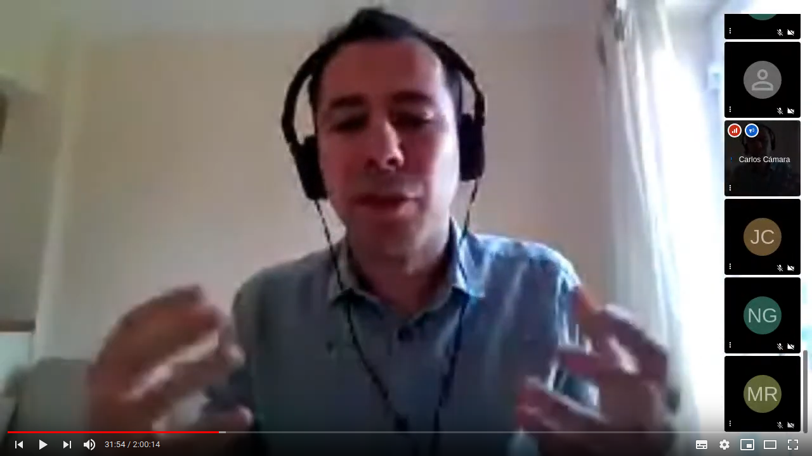

+++
title = "Participació en temps de COVID"
publishDate = 2020-06-19T10:00:06+02:00  # Schedule page publish date.
draft = false

# Talk start and end times.
#   End time can optionally be hidden by prefixing the line with `#`.
date = 2020-06-19T16:30:00+02:00
date_end = 2020-06-19T20:30:00+02:00

# Abstract and optional shortened version.
abstract = ""
summary = ""

# Name of event and optional event URL.
event = ""
event_url = ""

# Location of event.
location = "Online"

# Is this a selected talk? (true/false)
selected = false

# Projects (optional).
#   Associate this talk with one or more of your projects.
#   Simply enter the filename of your project file in `content/project/`.
#   E.g. `projects = ["deep-learning.md"]` references `content/project/deep-learning.md`.
#   Otherwise, set `projects = []`.
projects = []

# Tags (optional).
#   Set `tags = []` for no tags, or use the form `tags = ["A Tag", "Another Tag"]` for one or more tags.
tags = ["covid", "participación"]

# Links (optional).
url_pdf = ""
url_slides = ""
url_video = "https://youtu.be/9JHfnh54hMk"
url_code = ""

# Does the content use math formatting?
math = false

# Does the content use source code highlighting?
highlight = true

# Featured image
# To use, add an image named `featured.jpg/png` to your page's folder.
[image]
  placement = 2
  # Caption (optional)
  caption = ""

  # Focal point (optional)
  # Options: Smart, Center, TopLeft, Top, TopRight, Left, Right, BottomLeft, Bottom, BottomRight
  focal_point = "Smart"

+++

Debate abierto organizado por [Raons Públiques](https://raons.coop/) en el que hablaremos sobre la participación ciudadana en tiempos de Covid-19, cómo la alarma sanitaria afecta a la capacidad de participación, cómo se puedes ver transformados los procesos y acciones participativa, qué nuevas herramientas debemos empezar a utilizar.

Aquí tenéis el vídeo: 





¡Gracias a vosotros, Raons Públiques, por organizarlo!